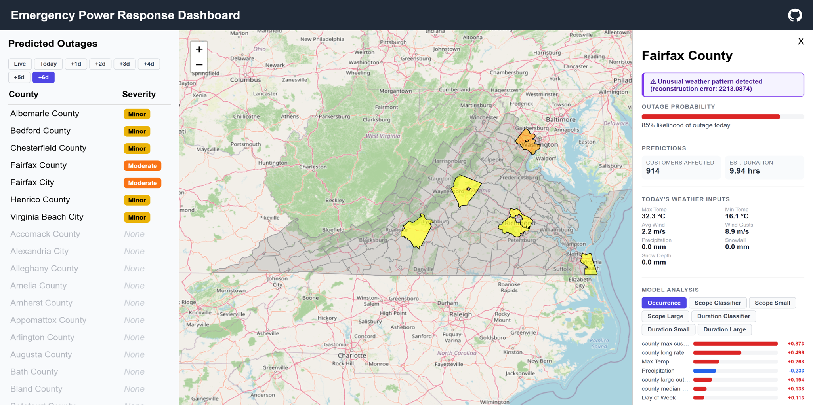

# AI System for Emergency Power Management

This is a multi-stage machine learning system designed to predict power outage information at the county level in Virginia. By combining historical outage data with real-time weather inputs, the system estimates the likelihood of an outage occurring, the outage's expected scope (number of customers affected), and the expected duration (time the outage lasts), which are then presented through an interactive dashboard. During severe weather events, utilities can struggle to maintain reliable electrical service due to demand surges and grid equipment failures. ​This machine learning system provides utilities with useful outage insights so they can be better prepared to respond to grid failures due to extreme weather.   

The modeling pipeline is built primarily using the Extreme Gradient Boosting (XGBoost) library. XGClassifiers are used to predict outage occurrence and XGRegressors are used to predict outage scope and duration. In addition to generating predictions, the system provides model interpretability by providing feature importance to the user. SHapley Additive exPlanations (SHAP) are used to quantify the contribution of input features for each model, enabling the user to better understand why a model made the decision it did.

## System Architecture


## Quick Start

All of the models are already trained and included, so you should be able to get the user interface up and running quickly. The system uses a Flask development server so you can easily run the application locally and display it in your browser.

### Install Dependencies

1. Make sure you have Python installed.

2. Create a virtual environment (optional but recommended):

```bash
python -m venv venv
source venv/bin/activate  # on windows: venv\Scripts\activate
```

3. Install required Python packages:

```bash
pip install -r requirements.txt
```

### Running the Dashboard Application

1. Run the Flask application:

```bash
python app/outage_app.py
```

2. Open a browser and go to:

```bash
http://127.0.0.1:5000/
```

You should see the following Virginia county map. Hover over a county to see the predicted outage information.
Click on a county to see the feature importance for the prediction.

## Training the Models

First, download the required datasets (this can take a while depending on your internet connection)

```
python data_download/download_noaa_data.py       # NOAA storm events (~2 min)
python data_download/download_eaglei_data.py     # EAGLE-I outages (~20 min)
python data_download/download_ghcnd_data.py      # GHCND climate (~10 min)
```

Next, run the training scripts. All data loading and preprocessing is handled here. You only need to run one script to train that model (i.e. if you want to retrain the duration model, just run duration/train_eval.py).

```bash
python occurrence/train_eval_occurrence.py       # Occurrence
python scope/train_eval_scope.py                 # Scope
python duration/train_eval.py                    # Duration
```

## Using the Dashboard



### Left Panel

The left panel contains the nowcasting/forecasting buttons which let the user choose how far into the future they want to predict outages, and a list of all counties in Virginia. Counties at the top of the list are those which have an outage being predicted, and counties grayed out indicate no outage is being predicted. The severity (color) is based on the scope estimation: <1000 customers affected is classified as a minor outage (yellow), 1000-5000 customers is classified as a moderate outage (orange), and >5000 customers is classified as a severe outage (red). Clicking on a county will zoom into it and bring up the feature importance panel.  

### Map

The center contains a map of every Virginia county and independent city. Hovering over a county shows the county's name along with the scope and duration predictions. The map corresponds to the county list on the left and the colors have the same meaning. Clicking on a county will bring up the feature importance panel.

### Right Panel

The right panel contains additional information about the selected county including the probability that an outage will occur, any anomalies detected, and current/forecasted weather information. Most importantly it contains the feature importance values for all models in the pipeline. The user can selected which model's SHAP values are displayed by selecting that model from the list of buttons.

### Other Buttons

In the top right are some additional buttons. The button on the left opens a console interface which displays updated real-time weather data fetching information, the question mark button opens a simple help menu for navigating the dashboard, and the GitHub button directs to the project's GitHub repository.

### Additional Information

- The dashboard can take a moment (~10 sec) to load on first launch
- Real-time data is automatically refreshed every 15 minutes

## Project Structure

```
S26-02-emergency-power/
├── anomaly_detection/
│   ├── autoencoder.py                      # Autoencoder for anomaly detection
│   ├── train_anomaly_detector.py           # Train isolation forest
│   └── train_autoencoder_from_pipeline.py  # Train autoencoder
├── app/
│   ├── static/
│   │   ├── Images/          # Images for dashboard
│   │   ├── counties.json    # County geometry shapes
│   │   ├── script.js        # JavaScript for dashboard website
│   │   └── style.css        # Stylesheet for dashboard website
│   ├── templates/
│   │   └── index.html       # HTML for dashboard website
│   └── outage_app.py        # Dashboard application script
├── data_download/
│   ├── duration/
│   │   ├── download_eaglei_data.py       # Eagle-I dataset download
│   │   ├── download_ghcnd_data.py        # GHCNd dataset download
│   │   └── download_noaa_data.py         # NOAA dataset download
│   ├── occurrence/
│   │   ├── download_eaglei_data.py       # Eagle-I dataset download
│   │   ├── download_ghcnd_data.py        # GHCNd dataset download
│   │   └── download_noaa_data.py         # NOAA dataset download
│   ├── scope/
│   │   ├── download_eaglei_data.py       # Eagle-I dataset download
│   │   ├── download_ghcnd_data.py        # GHCNd dataset download
│   │   └── download_noaa_data.py         # NOAA dataset download
│   ├── download_openmeteo_historical.py  # Open-Meteo historical dataset download
│   ├── export_county_stats.py            # Compute historical outage stats from EAGLE-I
│   └── generate_virginia_geo.py          # Generate latitude/longitude data for counties
├── inference/
│   ├── realtime_data_inventory.py        # Map real-time data types to models
│   ├── realtime_inference.py             # Real-time prediction pipeline for Virginia outages
│   └── weatherapi.py                     # Fetch real-time weather via Open-Meteo.
├── models/
│   ├── autoencoder.pt
│   ├── duration_forecast.joblib          
│   ├── duration_model.joblib
│   ├── isolation_forest.joblib
│   ├── occurrence_model.joblib           
│   ├── scope_forecast.joblib
│   └── scope_model.joblib                
├── outage_duration/
│   ├── src/
│   │   ├── data_loader.py                # Load and merge EAGLE-I and NOAA data
│   │   ├── evaluator.py                  # Compute MAE, RMSE, and MAPE metrics
│   │   ├── explainer.py                  # Duration SHAP analysis 
│   │   ├── model.py                      # One-stage duration model (Regression)
│   │   ├── preprocessor.py               # Feature engineering
│   │   └── two_stage_model.py            # Two-stage duration model (Classification --> Regression)
│   ├── .gitignore
│   ├── README.md
│   ├── requirements.txt
│   └── train_eval.py                     # Train and evaluate duration model
├── outage_occurrence/
│   ├── data_loader_occurrence.py         # Load and merge EAGLE-I, NOAA, and GHCNd data
│   ├── evaluator_occurrence.py           # Compute accuracy, precision, recall, F1, ROC_AUC, PR_AUC
│   ├── occurrence_explainer_model.py     # Occurrence SHAP analysis
│   ├── occurrence_model.py               # Occurrence model (Classification)
│   ├── occurrence_test.py                # Basic model and SHAP test
│   ├── preprocessor_occurrence.py        # Extract and prepare features for training
│   ├── test_pipeline_occurrence.py       # Smoke test for data loading and preprocessing pipline
│   └── train_eval_occurrence.py          # Train and evaluate occurrence model
├── outage_scope/
│   ├── models/
│   │   ├── .gitkeep
│   │   ├── autoencoder.pt
│   │   ├── duration_model.joblib
│   │   └── scope_model.joblib
│   ├── src/
│   │   ├── data_loader.py                # Load and merge EAGLE-I, NOAA, and GHCNd data
│   │   ├── evaluator.py                  # Compute MAE, RMSE, and MAPE metrics
│   │   ├── explainer.py                  # Scope SHAP analysis
│   │   ├── model.py                      # One-stage scope model (Regression)
│   │   ├── preprocessor.py               # Extract and prepare features for training
│   │   └── two_stage_model.py            # Two-stage scope model (Classification --> Regression)
│   ├── utils/
│   │   ├── .gitkeep
│   ├── README.md
│   ├── test_pipeline.py                  # Smoke test for data loading and preprocessing pipeline
│   └── train_eval_scope.py               # Train and evaluate scope model
├── tests/
│   ├── api_test.py    # Test real-time data APIs
├── .gitignore         # Files for Git to ignore
├── README.md          # Main project landing page
├── requirements.txt   # Required packages and dependencies
└── run_pipeline.py    # Run full cascade system tests
```

## Known Issues


## Future Work

- Expand to other states
- Retrain models with newer data 

## Acknowledgements

At this time, all APIs used are free and public.

We'd like to thank our sponsor Dr. Christiana Garcia and our subject matter experts Sadman Saif and Mohammadreza Saghafi for their support during this project.

## Useful Resources

Open-Meteo: https://open-meteo.com/  
US Census County Coordinates: https://www2.census.gov/geo/docs/maps-data/data/gazetteer/  
GHCN-Daily Data: https://www.ncei.noaa.gov/pub/data/ghcn/daily  
NOAA Storm Event Data: https://www.ncei.noaa.gov/pub/data/swdi/stormevents/csvfiles/  


